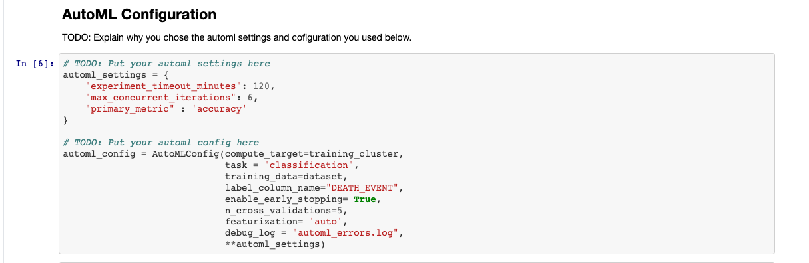
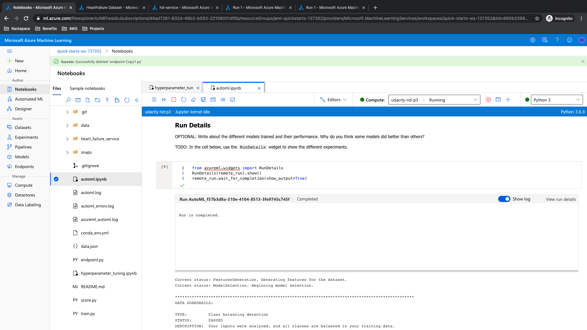
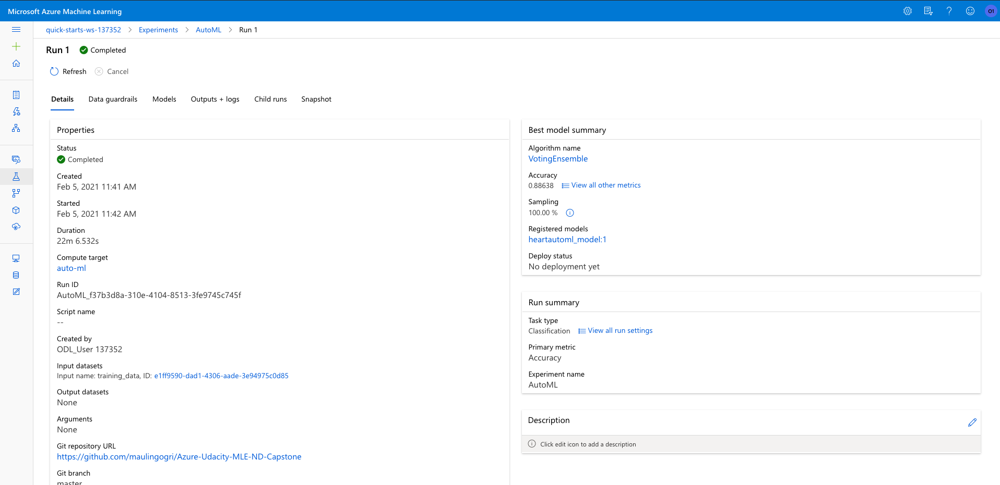
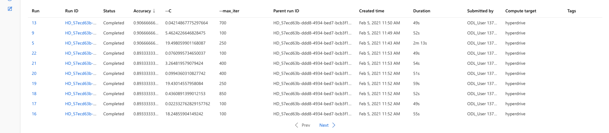
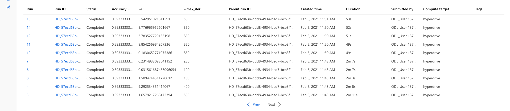
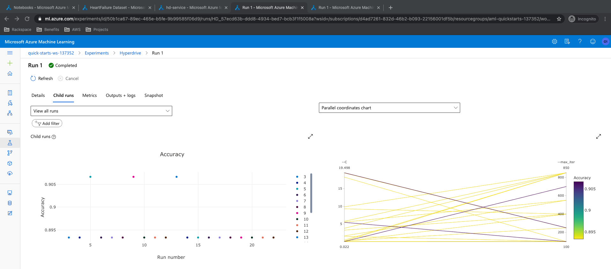
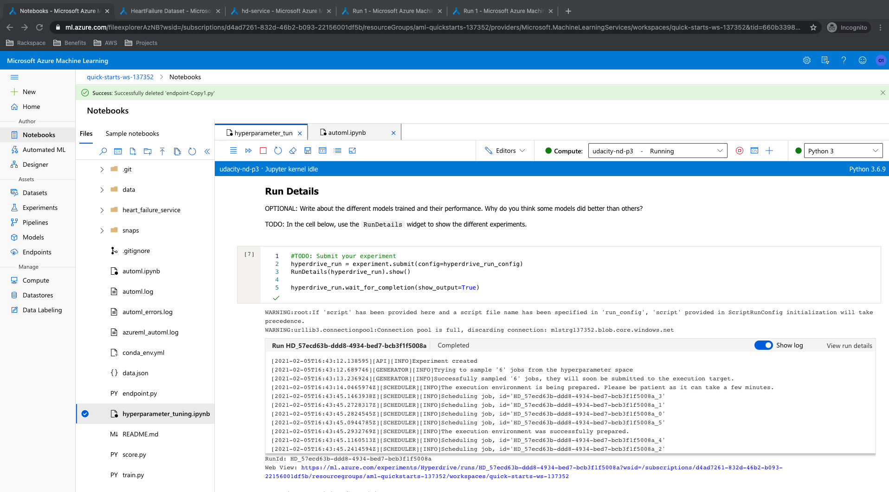

# Azure Machine Learning Engineering Nanodegree - Capstone Project
In this project I intended to build and deploy machine learning model to predict the Heart Failure in a patient knowing factors that can affect it. The dataset was imported to the Azure Workspace for modeling. Modeling was performed using two ways - AutoML and hyperdrive. Various models were tested in AutoML and best amongst them was picked. In hyperdrive, Logistic Regression using scikit-learn was performed by testing various parameters and the best model from this was chosen. Each of these models were compared on the basis of Accuracy and the better amongst them was deployed and tested. The endpoint was tested by passing score data points and obtaining results from post requests.

## Dataset
### Overview
I used the dataset available in kaggle for this project. 12 features that can affect Heart Failure and lead to mortality are used in this project. It is small sample with 299 data points. The predictive feature is 'DEATH_EVENT' which suggests if the death occurred in that particular patient which is binary column. Hence, classification using logistic regression was used for hyperdrive and general classification algorithms were used in AutoML.

### Task
Following is the description of all features:
* age of patient - Age (integer)
* anaemia - Decrease of red blood cells or hemoglobin (boolean)
* creatinine_phosphokinase - Level of the CPK enzyme in the blood (mcg/L) (integer)
* diabetes - If the patient is diabetic (boolean)
* ejection_fraction - Percentage of blood leaving the heart at each contraction (percentage)
* high_blood_pressure - If the person has hypertension (boolean)
* platelets - Platelets in the blood (kiloplatelets/mL) (float)
* serum_creatinine - Level of serum creatinine in the blood (mg/dL) (float)
* serum_sodium - Level of serum sodium in the blood (mEq/L) (integer)
* sex - Male of Female (binary)
Based on the attributes of these features, we can determine the chances of mortality because of heart failure. This historical data can be used for training the model and once we have data from new patients it can be used as score data to determine the chances of mortality in that patient.

### Access
I pushed the dataset in the [github repo](https://raw.githubusercontent.com/maulingogri/Azure-Udacity-MLE-ND-Capstone/master/data/heart_failure_clinical_records_dataset.csv) of this project. Using this public link I registered the dataset in the Azure Studio as well as called in the scripts using Python SDK. Following code snippet was used to access data:
```python
    # Create AML Dataset and register it into Workspace
    example_data = 'https://raw.githubusercontent.com/maulingogri/Azure-Udacity-MLE-ND-Capstone/master/data/heart_failure_clinical_records_dataset.csv'
    dataset = Dataset.Tabular.from_delimited_files(example_data)
    #Register Dataset in Workspace
    dataset = dataset.register(workspace=ws,
                               name=key,
                               description=description_text)
  data = dataset.to_pandas_dataframe()
```

## Automated ML
AutoML configuration that I used for this project is presented here:

I kept man timeout to 120 mins with 6 concurrent runs at a time. As discussed it is a classification problem and 'accuracy' was selected as primary metric. The reason for choosing accuracy in this case was that it is easy to explain results with accuracy and in future work other metrics can be tested. Cross validation was set to 5 for validation purpose. "DEATH_EVENT" which is the column that determines the mortality due to heart failure was selected as target feature. With 'auto' featurization - scaling and normalization of the dataset was enabled automatically. Error logs were captured for debugging purpose.

### Results
There were multiple algorithms tested during the AutoML run and a list of the top performing algorithm is shown below. 'VotingEnsemble' performed the best with 88.63% accuracy. Also present is RunDetails and screenshot showing the completed AutoML run and finding VotingEnsemble as best run.



More details about the VotingEnsemble model is presented here:

Avenues to improve the results include running the model for longer time, disabling early stopping, providing more training data or having more features.

## Hyperparameter Tuning
Logistic Regression algorithm from the scikit-learn library was used to run this model. Logistic regression can also provide the prediction probabilities which is not a common feature with the other classification models. Please find the parameters and the ranges used in hyperparameter search:

This being an inital run the parameter ranges are set broader. 'C' value was set to be randomly chosen from log uniform distribution between -4 and 3. For max iteration I set to choose random value from [100, 250, 400, 550, 700, 850, 1000]. The primary metric for this classification model was chosen as Accuracy and an early termination Bandit Policy was also set.

### Results
The best model in hyperdrive modeling had an accuracy of 90.66% accuracy. The 'C' value of 19.49 and max iterations of 250 runs were the parameters of the best model. List of all models, Accuracy mapping of all runs from ML Studio and RunDetails snippet are presented below.




Find below the details of the best run:

This run can be improved by changing the range of the hyperparameters, removing the early stopping policy or trying other tree based algorithm.

## Model Deployment
The best model of hyperdrive run was deployed as ACI endpoint using Python SDK. Find below the configuration of the endpoint deployed.

To query the endpoint I converted the sample list input to json and passed it through posts in request library in python. Key of using the endpoint was also attached. Find below the screenshot of the way to query the endpoint.


## Screen Recording
Link of the screencast for this project: https://youtu.be/5v-6r-d1Yrw

## Future Improvements
Few future recommendations for this project:
* Allow to run the AutoML module without time and early stop limitation
* Trying primary metrics other than Accuracy, like 'AUC Score', 'Recall', 'F1 Score' and 'Precision'
* Allow to run Hyperdrive without early stop policy
* Try frameworks other than scikit-learn, like TensorFlow and PyTorch
* Introducing regularization in the Logistic Regression framework
* Benchmarking the endpoint using tools like Apache Benchmark can also be very cruical

## Standout Suggestions
I deployed both AutoML and Hyperdive best models to experience difference in deployment techniques.

### Resources
* https://www.kaggle.com/andrewmvd/heart-failure-clinical-data
* https://github.com/MicrosoftLearning/DP100
